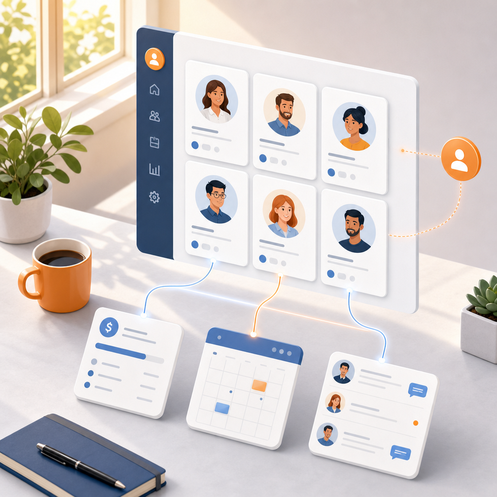

# מה זה CRM ולמה כל עסק צריך אותו

בואו נתחיל מהסוף, כדי שלא תצטרכו לחפש את התשובה בין השורות.

**CRM היא מערכת לניהול קשרי לקוחות.** בעברית פשוטה: זה המקום שבו מנהלים את הלידים, הלקוחות, הפגישות, המכירות, המנויים והתשלומים של העסק. הכל במקום אחד, מסודר, ונגיש.

ועכשיו האמת שלא תמיד נעים להגיד: עסק שעובד בלי CRM, לא באמת יכול לגדול לאורך זמן. בהתחלה אפשר להסתדר עם פתקים, אקסל ויומן בראש - אבל בשלב מסוים נתקלים בתקרת זכוכית. לא כי אין ביקוש, אלא כי אין סדר, אין מעקב, ואין שליטה בתהליכים.

## מה זה CRM באמת? בואו נצלול פנימה

CRM מאפשרת לכם לנהל במקום אחד את כל מה שקשור ללקוחות וללידים: מי פנה אליכם, מתי דיברתם איתו, באיזה סטטוס הוא נמצא, אילו עסקאות נסגרו מולו, ומה הצעד הבא.

זה אולי נשמע טריוויאלי, אבל עצם זה שתנהלו את הלקוחות והלידים שלכם בצורה מסודרת - יגדיל לכם את ההכנסות. אני אומרת את זה בהתחייבות.

### איך זה בנוי מאחורי הקלעים

ברמה הטכנית, מערכת CRM היא בעצם אוסף של טבלאות שמדברות אחת עם השנייה.

לדוגמה:
- יש טבלת לקוחות עם השמות, הטלפונים והמיילים.
- לצידה יש טבלת מכירות עם כל העסקאות שבוצעו בפועל.

החיבור ביניהן זה הקסם. כשנכנסים לכרטיס של לקוח מסוים - נגיד "יוסי לוי" (כן, הוא קונה מלא, אז בטח הוא גם לקוח שלכם 😅) - רואים מיד במקום אחד:

- את כל המכירות שבוצעו מולו
- את המשימות הפתוחות לגביו
- את היסטוריית השיחות והפגישות

הכל מחובר, הכל מתועד, ואין יותר ניחושים ופספוסים.

## מה מערכת CRM עושה בפועל ביום-יום

הבנו את העקרון, עכשיו בואו נדבר תכלס. במקום פתקים, יומן ידני וקבצי אקסל מפוזרים בין שולחנות, ה-CRM מרכזת את כל הפעולות במקום אחד ומאפשרת לעסק לעבוד מסודר, עקבי ושקוף.

הנה מה שהיא עושה עבורכם:

- **ריכוז נתונים** - כל פרטי הלקוח בכרטיס אחד ברור ונגיש: טלפון, מייל, תפקיד, תאריך לידה, וכל מה שחשוב לכם לנהל.
- **תיעוד תקשורת** - היסטוריה מלאה של פגישות, מיילים, שיחות וסיכומים. תמיד יודעים מה נאמר, מתי, ועם מי.
- **ניהול משימות ופולואפים** - CRM טובה דואגת שלא תשכחו לחזור ללקוח, לשלוח הצעת מחיר או לבצע פולואפ בזמן. זה אחד הכלים הכי חזקים להגדלת מכירות.
- **אחסון מסמכים** - הצעות מחיר, חוזים וחשבוניות יושבים בתוך כרטיס הלקוח, מסודרים לפי האופן שאפיינתם.
- **דאשבורדים ודוחות** - תמונה ברורה של העסק: כמה כסף נכנס, מה אחוזי ההמרה, כמה עסקאות נסגרו החודש, ואיפה צריך להשתפר. הכל שקוף, מדיד, וברור.

## יתרונות שמתורגמים לזמן ולכסף

היתרונות של CRM לא נשארים תיאורטיים. הם מתורגמים די מהר לזמן שנחסך ולכסף שנכנס.

- **אף ליד לא הולך לאיבוד.** כל פנייה נכנסת ומתועדת. לא מפספסים הזדמנויות, לא משאירים כסף על הרצפה - תופעה שמפתיע כמה היא נפוצה בעסקים בלי CRM.
- **חיסכון אדיר בזמן.** פחות חיפושים אחרי מספרי טלפון ישנים, פחות ניחושים מה נאמר בשיחה הקודמת, פחות "מתי בעצם חזרתי אליו לאחרונה?". התוצאה: יותר זמן נטו על מה שבאמת מייצר גדילה.
- **שיפור משמעותי בשירות.** דוגמה קטנה מהחיים: בהרבה פיצריות שמזמינים מהן, כל פעם מחדש מבקשים טלפון, כתובת ותוספות - למרות שזה תמיד אותו דבר. זה היה אשכרה מבאס אותי. כשלקוח מתקשר ואתם יודעים מיד מי הוא, מה הוא קנה ומתי דיברתם איתו לאחרונה - הוא מרגיש שמכירים אותו. אמון מייצר הכנסות.
- **קבלת החלטות חכמה.** במקום לנחש מה כדאי לעשות הלאה, רואים מספרים: איזה מוצר נמכר הכי טוב, איזה קמפיין עובד, איפה שווה להשקיע יותר. מפסיקים לעבוד על תחושות בטן, מתחילים לעבוד על דאטה.
- **סטנדרטיזציה בצוות.** כולם עובדים באותה שיטה, שולחים את אותן הצעות מחיר, שומרים על תהליך אחיד. חלאס לברדק - העסק נראה ומתנהל כמו עסק רציני.

## למי באמת כדאי להשתמש ב-CRM?

תשובה קצרה: לכל מי שיש לו לקוחות והזמן שלו חשוב לו. אם הגעתם עד לפה, כנראה שקלעתי לתיאור.

תשובה מפורטת יותר:

- **עסקים קטנים ופרילנסרים** - זה שאתם עסק קטן לא אומר שלא צריך לחשוב על שלב הגדילה הבא. מי שלא עובד מסודר בהתחלה, מגלה בהמשך שיותר קשה לעשות סקייל - גם כשיש ביקוש.
- **צוותי מכירות** - חובה חובה חובה. אין מצב לנהל מכירות ברצינות בלי CRM. אנשי מכירות צריכים לנהל יעדים, לעקוב אחרי עסקאות, לחזור ללידים בזמן. כל עיכוב בטלפון חוזר = סיכוי קטן יותר לסגור.
- **מוקדי שירות לקוחות** - זוכרים את סיפור הפיצה? זה מינימום שירות שהייתי מצפה מפיצריה. בחברה רצינית עם טלפנים, לקוחות מצפים להרבה יותר. שירות לקוחות בלי גישה מיידית להיסטוריית הפניות פשוט לא עובד.
- **חברות B2B** - אם יש מי שמעריך שירות, מקצועיות והיכרות אמיתית עם הלקוח, אלה עסקים. זה המקום האחרון שתרצו להיראות בו לא מסודרים או לא מחוברים לפרטים.

## מה ההבדל בין CRM לבין מערכת אוטומציה שיווקית?

אנשים מתבלבלים. חושבים ש-CRM אומרת בהכרח שגם עושים אוטומציות. זה פשוט לא מדויק.

מערכת CRM נועדה לנהל את הקשרים עם הלקוחות שלכם. נכון, לרוב המערכות יש אוטומציות פנימיות חכמות - יצירת משימות, תזכורות, שינוי סטטוסים, וכל מיני "שטיקים" שעוזרים לעבוד מסודר יותר (תלוי באיזו מערכת תבחרו).

אבל, וזה אבל חשוב - היכולות האוטומטיות של ה-CRM ברוב המקרים מוגבלות.

כשרוצים לבנות תהליכים חכמים באמת - כאלה שמחברים בין שיווק, מכירות ותפעול - צריכים מערכת חיצונית. כאן נכנסות מערכות כמו Make, שמאפשרות לבנות אוטומציות מתקדמות, גם שיווקיות וגם תפעוליות, בלי להיות תלויים במגבלות של ה-CRM עצמו.

השילוב בין CRM מסודר לבין מערכת אוטומציה חכמה - הוא מה שהופך תהליך רגיל למערכת שמתנהלת כמעט לבד.

## איך לבחור CRM שמתאים לעסק שלכם

הדבר הכי חשוב להפנים: בחירת CRM היא לא תחרות מלכת היופי. אתם לא מחפשים את המערכת הכי צבעונית, ולא את זו עם הכי הרבה פיצ'רים. אתם מחפשים את זו שנוחה לכם לעבוד איתה.

אל תסתנוורו מפיצ'רים מפוצצים שלא תשתמשו בהם בפועל. תתמקדו בדברים שעושים הבדל ביום-יום:

- **קלות שימוש** - אם זה מסובך, העובדים פשוט לא ישתמשו.
- **תמיכה בעברית**.
- **חיבור למערכות שאתם כבר עובדים איתן**.

ולפני שמתחייבים - חובה לעשות נסיעת מבחן. כמעט כל מערכת מאפשרת תקופת התנסות. תבדקו אותה בשטח, עם תהליכים אמיתיים, לא רק עם דמו יפה.

בסוף, המערכת המנצחת היא לא היקרה ביותר. היא זו שהצוות שלכם אשכרה מצליח לתפעל ביום-יום, בלי לשבור את הראש.

## איזה אוטומציות אפשר לשלב ב-CRM?

זמן שווה כסף. אם הגעתם לקרוא מאמר על CRM, כנראה שאתם כבר מבינים את זה מצוין.

ההחזר האמיתי על ההשקעה שלכם בזמן נמצא בתהליכי האוטומציה שתבנו סביב ה-CRM.

יש אינסוף אוטומציות אפשריות. הנה כמה דוגמאות כדי שתבינו את הכיוון:

- **קליטת לידים** - ליד השאיר פרטים באתר? הוא נפתח אוטומטית במערכת ומקבל הודעת וואטסאפ בנוסח "קיבלנו את פנייתך".
- **תזכורות אוטומטיות** - סטטוס של לקוח לא השתנה שבועיים? המערכת יוצרת לכם משימה: "צור קשר עם הלקוח".
- **ברכות אישיות** - יום הולדת ללקוח? נשלח SMS עם ברכה והטבה קטנה.
- **הפקת מסמכים** - נסגרה עסקה? המערכת מפיקה חשבונית ושולחת אותה במייל - בלי התעסקות ידנית.

## בשורה התחתונה

אם שאלתם את עצמכם מה זה CRM ולמה כולם מדברים על זה - עכשיו התשובה ברורה.

אל תזניחו את הנושא הזה. תבחרו מערכת שמתאימה לכם, ולא כזו שתכריח אתכם להתאים את עצמכם אליה. בחירת CRM נכונה היא אחת ההחלטות העסקיות החכמות שתעשו.

זה המעבר מעסק שמתנהל ב"כיבוי שריפות" לעסק שמנוהל על ידי סיסטם ברור, מדיד ורווחי.

ואל תיבהלו מהטכנולוגיה. המערכות של היום בנויות ככה שכל אחד יכול להפעיל אותן, בלי ללמוד ארבע שנים מדעי המחשב.

תתחילו בקטן. תבנו את הטבלאות הראשונות שלכם, תעשו סדר בדאטה, ותראו איך ההכנסות מתחילות לגדול בצורה שלא דמיינתם.

## שאלות ותשובות

### האם CRM מתאים גם לעסק בלי אנשי מכירות?
כן. CRM לא מיועדת רק למכירות - היא מנהלת לקוחות, תהליכים, שירות, מסמכים ותיאומים.

### כמה עולה מערכת CRM?
מ-0 ש"ח (יש מערכות חינמיות) ועד מאות שקלים בחודש. המחיר תלוי בכמות משתמשים, בפיצ'רים, ובכמות הדאטה הקיימת.

### האם אפשר לחבר CRM למערכות אחרות בעסק?
בוודאי - וזה אחד היתרונות הכי גדולים. אפשר לחבר אתר, דפי נחיתה, מערכות חשבוניות, וואטסאפ, גוגל דרייב, ניהול תשלומים, צ'אטבוטים ועוד. בגדול, כל CRM שנותן גישת API אפשר לחבר גם למערכות אוטומציה כמו Make ולבנות תהליכים חכמים כמעט בלי הגבלה.

### האם CRM בטוח לשימוש? מה לגבי מידע רגיש?
רוב המערכות עומדות בתקני אבטחה גבוהים (GDPR, הצפנת מידע וכו'). מה שחשוב: לבחור מערכת מוכרת ולהגדיר הרשאות נכונות בצוות.

### האם CRM יכולה להחליף עובדים?
לא. CRM לא מחליפה עובדים - היא משחררת להם זמן לעבודות החשובות באמת. פחות בזבוז זמן על משימות לא יעילות = יותר מכירות, שירות טוב יותר, ושקט נפשי בהתנהלות היומיומית.

### כמה זמן לוקח להטמיע מערכת CRM בעסק?
תלוי בהיקף ובמורכבות:
1. עסק קטן: בין כמה שעות ליום עבודה אחד.
2. עסק גדול עם צוותים ותהליכים מורכבים: בין מספר ימים לשבועות.

### האם צריך ידע טכני כדי לעבוד עם CRM?
לא צריך להיות מתכנתים. ידע טכני בסיסי לגמרי מספיק. רוב המערכות היום פשוטות לתפעול, עם ממשק אינטואיטיבי. ברוב המקרים ההגדרה הראשונית היא החלק היחיד שדורש קצת עזרה מקצועית. תכלס, אם פעם בניתם מצגת בפאוורפוינט או שיחקתם קצת עם אקסל - הרמה הטכנולוגית שלכם מספיקה לחלוטין.

### האם CRM מתאים גם לעסק קטן של אדם אחד?
בהחלט. דווקא בעסק קטן שבו הכל עליכם, CRM עוזרת לשמור על סדר, לזכור פולואפים, ולנהל לקוחות בצורה מקצועית - בלי אקסלים מפוזרים ופתקים. אני יכולה להגיד בוודאות שזה עזר לי, ולתלמידים שלי, להגדיל משמעותית את כמות הלקוחות וההכנסות.
